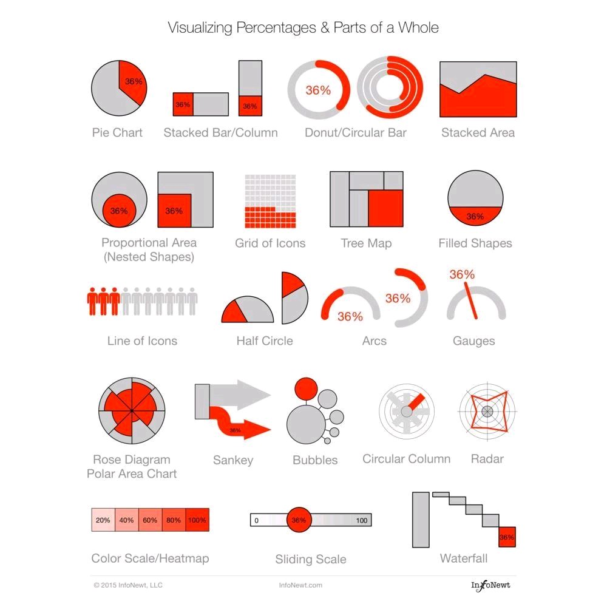

## Data-Visualization

| Plots                  | Charts                 | Diagrams              |  Others              |
| -----------------------|------------------------|-----------------------|----------------------|
| Line plot              | Pie chart              | Trellis diagram       |                      |
| Box plot               | Bar chart              | Wind rose diagram     |                      |
| Dot plot               | Radar chart            | Histogram             |     Spectrograms     |
| Bar plot               | Correlogram            | Sankey diagram        |                      |
| Scatter plot           | Heatmap                | Venn diagram          |                      | 
| Q-Q plot               | Treemap                |                       |                      |
| Density plot           | Area chart             |                       |                      |
| Contour plot           | Stacked Area chart     |                       |                      |
| Surface plot           | Stacked Line chart     |                       |                      |
| Violin plot            |                        |                       |                      |
| Time series plot       |                        |                       |                      |   
| Biplot                 |                        |                       |                      |
| Bland-Altman plot      |                        |                       |                      |
| Stem and Leaf Plot     |                        |                       |                      |
| Raincloud plot         |                        |                       |                      |
| Quiver plots           |                        |                       |                      |

## Visualization Libraries and Tools/Softwares

| Python libraries   | R libraries   | Tools/Softwares           |  
|--------------------|---------------|---------------------------|
| Matplotlib         | ggplot2       | Tableau                   |
| Seaborn            | Lattice       | Power BI                  |
| Plotly             | highcharter   | Sisense                   |
| ggplot             | Leaflet       | Zoho Reports              |
| Altair             | RColorBrewer  | Google Data Studio        |
| Bokeh              | Plotly        | Datawrapper               |
| pygal              | sunburstR     | Chartbuilder              |
| geoplotlib         | RGL           | FineReport                |
| Networkx           | dygraphs      | Vega                      |
| Gleam              |               | D3.js                     |
| missingno          |               | Highcharts                |
| Leather            |               | Information is Beautiful  |
|                    |               | Qlikview                  |

 

<!-- 
I love supporting the **[EFF](https://eff.org)**.
This is the *[Markdown Guide](https://www.markdownguide.org)*.
See the section on [`code`](#code)-->
