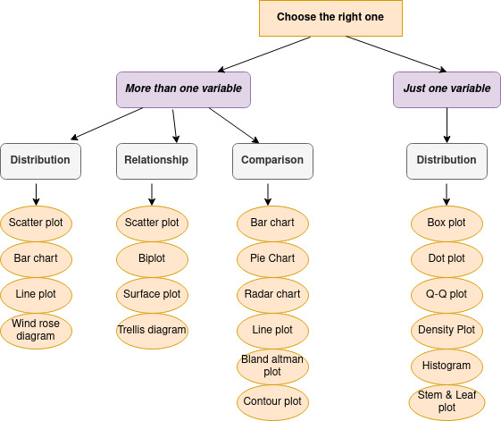

## Data-Visualization

| Python libraries   | R libraries   | Tools/Softwares        | Plots                 | Charts                 | Diagrams              |  Others              |
|--------------------|---------------|------------------------|-----------------------|------------------------|-----------------------|----------------------|
| Matplotlib         | ggplot2       | Tableau                | Line plot             | Pie chart              | Trellis diagram       |                      |
| Seaborn            | Lattice       | Power BI               | Box plot              | Bar chart              | Wind rose diagram     |                      |
| Plotly             | highcharter   | Sisense                | Dot plot              | Radar chart            | Histogram             |     Spectrograms     |
| ggplot             | Leaflet       | Zoho Reports           | Bar plot              | Correlogram            | Sankey diagram        |                      |
| Altair             | RColorBrewer  | Google Data Studio     | Scatter plot          | Heatmap                | Venn diagram          |                      | 
| Bokeh              | Plotly        | Datawrapper            | Q-Q plot              | Treemap                |                       |                      |
| pygal              | sunburstR     | Chartbuilder           | Density plot          | Area chart             |                       |                      |
| geoplotlib         | RGL           | FineReport             | Contour plot          | Stacked Area chart     |                       |                      |
| Networkx           | dygraphs      | Vega                   | Surface plot          | Stacked Line chart     |                       |                      |
| Gleam              |               | D3.js                  | Violin plot           |                        |                       |                      |
| missingno          |               | Highcharts             | Time series plot      |                        |                       |                      |   
| Leather            |               | Information is Beautiful| Biplot               |                        |                       |                      |
|                    |               | Qlikview               | Bland-Altman plot     |                        |                       |                      |
|                    |               |                        | Stem and Leaf Plot    |                        |                       |                      |
|                    |               |                        | Raincloud plot        |                        |                       |                      |
|                    |               |                        | Quiver plots          |                        |                       |                      |

 

<!-- 
I love supporting the **[EFF](https://eff.org)**.
This is the *[Markdown Guide](https://www.markdownguide.org)*.
See the section on [`code`](#code)-->
